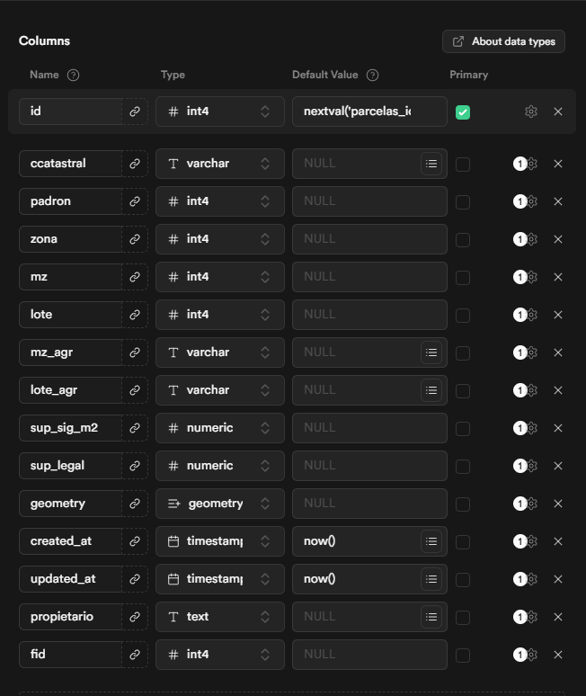

#Tablas

1. Primera consulta ejecutada:
```sql
-- Enable PostGIS extension for geographic data
CREATE EXTENSION IF NOT EXISTS postgis;

-- Table for parcels (parcelas)
CREATE TABLE parcelas (
    id SERIAL PRIMARY KEY,
    ccatastral VARCHAR(20) UNIQUE NOT NULL,
    objectid INTEGER,
    dpto VARCHAR(10),
    dist INTEGER,
    padron INTEGER,
    zona INTEGER,
    mz INTEGER,
    lote INTEGER,
    t_mesa INTEGER,
    exp INTEGER,
    gest INTEGER,
    mz_agr VARCHAR(10),
    lote_agr VARCHAR(10),
    sup_sig_m2 NUMERIC,
    obs TEXT,
    nuevo INTEGER,
    id_parcela INTEGER,
    tipo INTEGER,
    tipo_pavim VARCHAR(50),
    nombre_obj VARCHAR(100),
    sup_legal NUMERIC,
    zona_urban INTEGER,
    cc_matriz VARCHAR(50),
    orig_parc VARCHAR(50),
    reg_prof VARCHAR(50),
    finca VARCHAR(50),
    colonia VARCHAR(50),
    matricula VARCHAR(50),
    parc_usrin VARCHAR(50),
    parc_fchin TIMESTAMP,
    parc_usrac VARCHAR(50),
    parc_fchac TIMESTAMP,
    tmp_shape TEXT,
    ac_tecnico VARCHAR(100),
    ac_obs TEXT,
    ac_verificado VARCHAR(50),
    ac_fecha TIMESTAMP,
    s25_inm_sup_te NUMERIC, -- Surface with construction
    geometry GEOMETRY(MultiPolygon, 4326),
    created_at TIMESTAMP DEFAULT NOW(),
    updated_at TIMESTAMP DEFAULT NOW()
);

-- Table for notifications
CREATE TABLE notificaciones (
    id SERIAL PRIMARY KEY,
    ccatastral VARCHAR(20) REFERENCES parcelas(ccatastral) ON DELETE CASCADE,
    notified_at TIMESTAMP DEFAULT NOW(),
    notified_by VARCHAR(100),
    observations TEXT,
    cuenta_catastral VARCHAR(50),
    status VARCHAR(20) DEFAULT 'notified', -- notified, pending, verified
    created_at TIMESTAMP DEFAULT NOW(),
    updated_at TIMESTAMP DEFAULT NOW()
);

-- Indexes for better performance
CREATE INDEX idx_parcelas_ccatastral ON parcelas(ccatastral);
CREATE INDEX idx_parcelas_s25_inm_sup_te ON parcelas(s25_inm_sup_te);
CREATE INDEX idx_parcelas_geometry ON parcelas USING GIST(geometry);

CREATE INDEX idx_notificaciones_ccatastral ON notificaciones(ccatastral);
CREATE INDEX idx_notificaciones_notified_at ON notificaciones(notified_at);
CREATE INDEX idx_notificaciones_status ON notificaciones(status);

-- Enable Row Level Security (optional, for now we'll disable it for testing)
ALTER TABLE parcelas ENABLE ROW LEVEL SECURITY;
ALTER TABLE notificaciones ENABLE ROW LEVEL SECURITY;

-- Create policies (allow all for now, refine later)
CREATE POLICY "Enable read access for all users" ON parcelas FOR SELECT USING (true);
CREATE POLICY "Enable read access for all users" ON notificaciones FOR SELECT USING (true);
CREATE POLICY "Enable insert for authenticated users" ON notificaciones FOR INSERT WITH CHECK (true);
CREATE POLICY "Enable update for authenticated users" ON notificaciones FOR UPDATE USING (true);
```

2. Se agrego:
- elimine la mayoria de la columnas en la y cree fid y propietario nulables. solo quedaron las columnas de la imagen.
